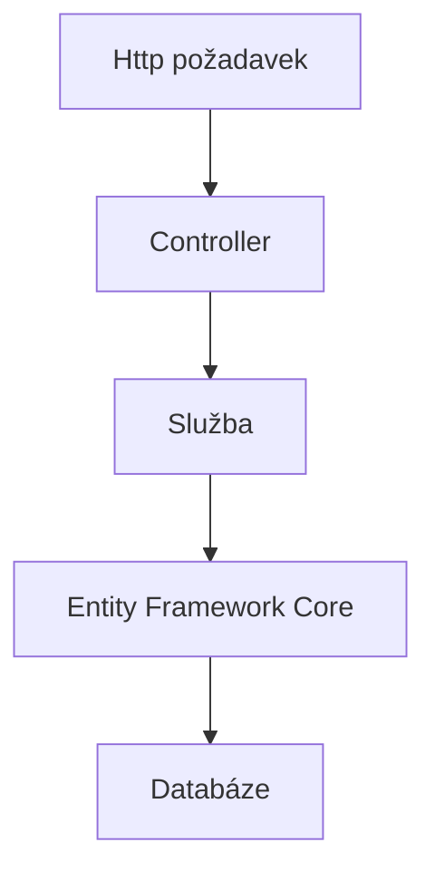

# Competition Tracker API
API pro soutěžní aplikaci vytvořené v ASP.NET Core.

## Princip
Uživatelé jsou rozděleni na dvě skupiny: moderátoři (Moderator) a soutěžící (Contestant). Moderátoři vytváří otázky (Question), které soutěžící zodpovídají (Answer). Moderátoři poté hodnotí jednotlivé odpovědi. API dále dokáže vytvořit žebříček (leaderboard), ve kterém sečte dosažená skóre všech soutěžících z jednotlivých otázek.

## Architektura
Projekt využívá vícevrstvou architekturu. HTTP požadavky zpracovávají ASP.NET Core Controllery, které delegují business logiku do servisní vrstvy. Přístup k databázi je realizován pomocí Entity Framework Core a SQLite. Komunikace s klientem probíhá prostřednictvím DTO, čímž jsou odděleny databázové entity od veřejného API.

## Další rozvoj
- [ ] Implementovat JWT autentizaci
- [ ] Rozšířit nabídku formátu otázek o obrázky
