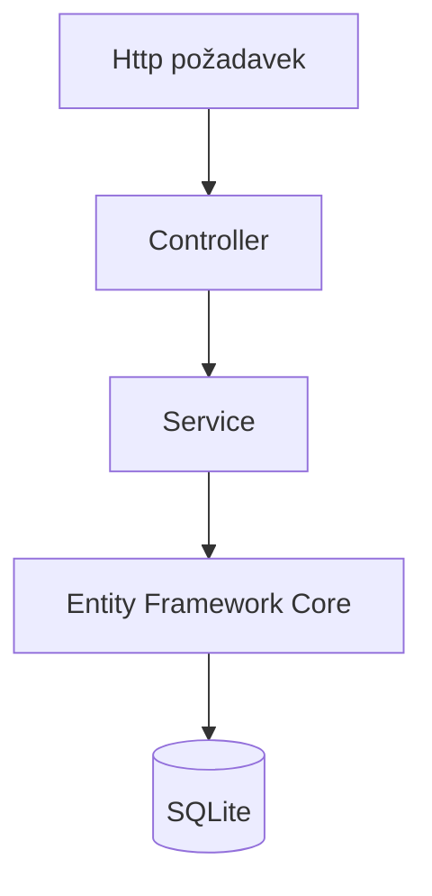
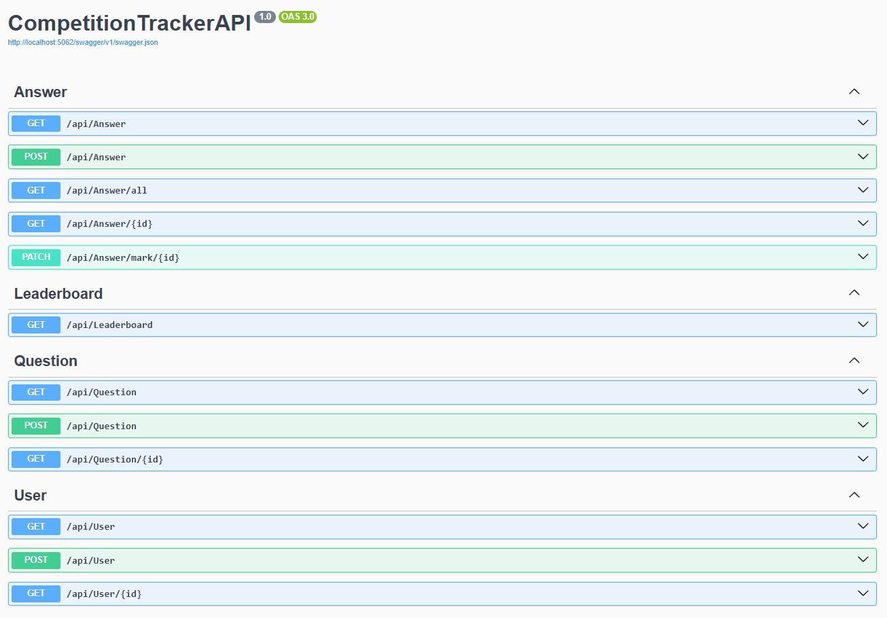

# Competition Tracker API
API pro soutěžní aplikaci vytvořené v ASP.NET Core. Jedná se o demonstrační projekt zaměřený na návrh vícevrstvé backendové aplikace. Po spuštění je API dostupné prostřednictvím Swagger UI.

## Princip
Uživatelé jsou rozděleni na dvě skupiny: moderátoři (Moderator) a soutěžící (Contestant). Moderátoři vytváří otázky (Question), které soutěžící zodpovídají (Answer). Moderátoři poté hodnotí jednotlivé odpovědi. API také vytváří žebříček soutěžících na základě součtu bodů získaných za správně ohodnocené odpovědi.

## Použité technologie

- ASP.NET Core (.NET 10)
- Entity Framework Core
- SQLite
- Swagger (OpenAPI)
- Dependency Injection
- DTO pattern
- REST API

## Spuštění projektu

1. Naklonujte repozitář

```bash
git clone https://github.com/davesm77/CompetitionTrackerAPI.git
```

2. Obnovte závislosti

```bash
dotnet restore
```

3. Vytvořte databázi pomocí migrací

```bash
dotnet ef database update
```

4. Spusťte aplikaci

```bash
dotnet run
```

## Architektura
Projekt využívá vícevrstvou architekturu. HTTP požadavky zpracovávají ASP.NET Core Controllery, které delegují business logiku do servisní vrstvy. Přístup k databázi je realizován pomocí Entity Framework Core, přičemž databázovým systémem je SQLite. Komunikace s klientem probíhá prostřednictvím DTO, čímž jsou odděleny databázové entity od veřejného API.



## Struktura projektu

```text
CompetitionTrackerAPI/
├── Controllers/    # HTTP endpointy
├── Data/           # DbContext a inicializace databáze
├── DTO/            # Datové přenosové objekty
├── Interfaces/     # Rozhraní služeb
├── Migrations/     # EF Core migrace
├── Models/         # Databázové entity
├── Services/       # Business logika
├── Program.cs
└── README.md
```

## Funkce

- Správa uživatelů
- Správa otázek
- Odpovědi soutěžících
- Hodnocení odpovědí
- Leaderboard

## Databáze

- **Databáze:** SQLite
- **ORM:** Entity Framework Core
- **Přístup:** Code First + Migrations
- **Inicializace:** Automatické vložení ukázkových dat při prvním spuštění

## Swagger



## Plánované funkce
- [ ] Implementovat JWT autentizaci
- [ ] Rozšířit nabídku formátu otázek o obrázky

## Co jsem se v projektu naučil

- návrh REST API
- Entity Framework Core
- Code First přístup a migrace
- Dependency Injection
- DTO pattern
- vícevrstvá architektura